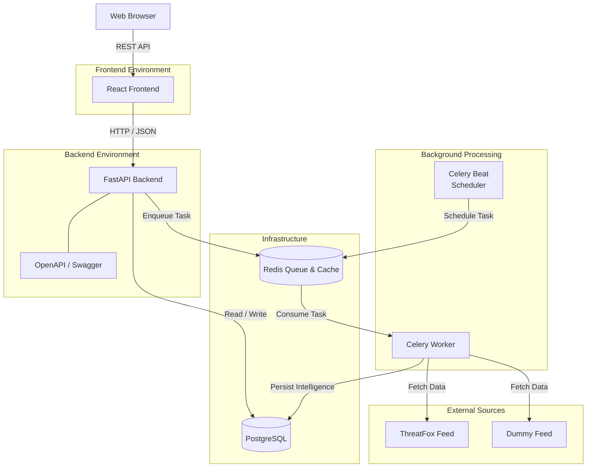
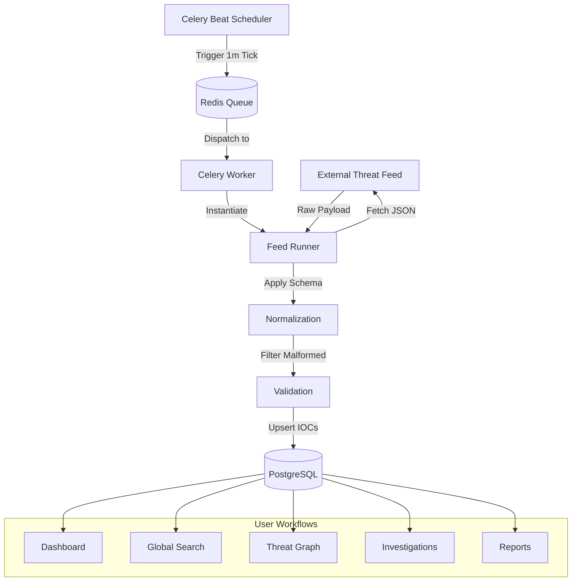
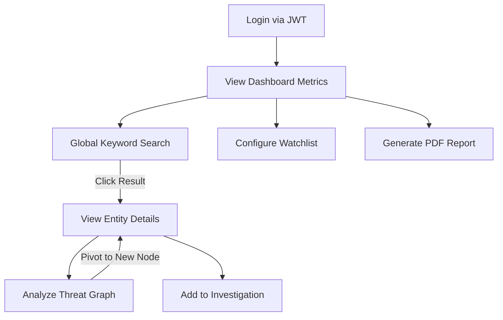

# Enterprise Threat Intelligence Platform (TIP)


A modern, scalable, and modular platform designed to collect, normalize, correlate, enrich, search, and visualize cyber threat intelligence.

## Overview

The Threat Intelligence Platform (TIP) provides a centralized workspace for Security Operations Centers (SOC), incident responders, and threat hunters to aggregate and analyze intelligence from disparate sources. By normalizing external feeds into a common internal model and applying automated correlation, the platform helps analysts quickly answer a critical question: *"Is this threat relevant to our organization, and what do we know about it?"*

The system is designed to process and correlate indicators with efficient search, background intelligence collection, and concurrent operational workflows.

### Key Capabilities
- **Automated Collection:** Polls and normalizes external OSINT feeds via background workers.
- **Relational Correlation:** Automatically links overlapping intelligence across campaigns, actors, and vulnerabilities.
- **Visual Threat Graph:** Provides an interactive node-based view for pivoting through connected indicators.
- **Investigative Workspaces:** Allows analysts to track and map incidents in dedicated, isolated contexts.
- **Proactive Watchlists:** Monitors incoming intelligence against critical organizational assets.
- **Granular Access Control:** Enforces strict RBAC for Admins, Analysts, and Viewers.
- **Stateless Architecture:** Scales horizontally using JWT auth, Redis queues, and Celery workers.
- **Optimized UI:** Delivers a responsive experience via React.lazy code splitting and TanStack Query caching.

### Why this project?
- **Motivation:** Security teams often struggle with intelligence fragmentation, spending too much time manually correlating spreadsheets and disjointed threat feeds.
- **The Problem:** Existing commercial solutions can be prohibitively expensive, overly complex, or difficult to extend with custom integrations. 
- **The Differentiator:** Unlike a standard CRUD application, this platform acts as an automated ingestion engine. It actively polls, normalizes, and correlates data in the background, transforming raw IOCs into structured intelligence before an analyst even logs in.

---

## Features

### Authentication & Authorization
- **JWT-Based Authentication:** Secure, stateless access and refresh tokens.
- **Role-Based Access Control (RBAC):** Granular permissions for Admin, Analyst, and Viewer roles.
- **Secure Credential Storage:** Passwords hashed via bcrypt with configurable work factors.

### Threat Intelligence Core
- **Indicators:** Lifecycle tracking for diverse IOC types (IPv4, IPv6, Domain, URL, MD5, SHA1, SHA256).
- **Threat Actors:** Profiles detailing origin, motivation, and historical activity.
- **Campaigns:** Tracking of coordinated attacks and operations.
- **Malware:** Families and variants tracking with signature mapping.
- **Vulnerabilities:** CVE associations mapped against observed campaigns.

### Analyst Workflows
- **Investigations:** Dedicated workspaces for tracking active security incidents and mapping related intelligence.
- **Watchlists:** Automated alerting and persistent monitoring for critical organizational assets.
- **Reports:** Static and dynamic intelligence reports (Daily, Weekly, Monthly, Executive) with PDF export.
- **Threat Graph:** Interactive, node-based visualizer for exploring complex entity relationships and pivoting through intelligence.

### Data Collection & Processing
- **Feed Management:** Configurable integration with external OSINT and commercial feeds (e.g., ThreatFox).
- **Global Search:** Low-latency, cross-entity keyword search and filtering.
- **Dashboard:** High-level operational overview, real-time threat activity metrics, and feed status monitoring.

### UI/UX & Runtime
- **Modern Interface:** Responsive, accessible, and fast UI with dark mode support.
- **Optimized Performance:** React.lazy code splitting, Suspense loading states, and layout-specific Skeletons.
- **Asynchronous Processing:** Celery-backed worker nodes for heavy I/O operations (feed polling, intelligence enrichment).

---

## Screenshots

<!-- Dashboard Screenshot -->

<!-- Graph Screenshot -->

<!-- Investigations Screenshot -->

---

## Architecture

The platform follows a decoupled client-server architecture, utilizing a robust background processing queue for long-running tasks.

### System Architecture



### Threat Intelligence Processing Pipeline



### User Interaction Flow



### Request Flow
1. **Synchronous (API):** The React frontend queries the FastAPI backend via REST. FastAPI queries PostgreSQL for state and responds immediately.
2. **Asynchronous (Background):** For heavy tasks (e.g., syncing a feed), FastAPI dispatches a message to Redis. The Celery Worker consumes the message, executes the task, and persists the result directly to PostgreSQL.

---

## Technology Stack

| Component          | Technology                                                                 |
|--------------------|----------------------------------------------------------------------------|
| **Frontend**       | React 19, TypeScript, Vite, Tailwind CSS v4, shadcn/ui, TanStack Query     |
| **Backend**        | Python 3.12, FastAPI, SQLAlchemy 2.0, Pydantic, Alembic                    |
| **Database**       | PostgreSQL 16                                                              |
| **Caching/Queue**  | Redis 7                                                                    |
| **Task Engine**    | Celery                                                                     |
| **Authentication** | JWT, bcrypt, python-jose, passlib                                          |
| **Deployment**     | Docker, Docker Compose                                                     |

---

## Project Structure

The repository is divided into independent service domains to ensure separation of concerns and maintainability.

- **`backend/`**: Contains the FastAPI application and Celery workers.
  - **`app/core/`**: Handles central configuration, database session management, Redis connections, and Celery initialization.
  - **`app/db/`**: Manages Alembic migrations, SQLAlchemy declarative bases, and shared association tables.
  - **`app/features/`**: Contains domain-driven modules (e.g., `feeds`, `indicators`, `auth`). Each module is entirely self-contained with its own models, schemas, routers, and background tasks to prevent tight coupling.
- **`frontend/`**: Contains the React single-page application.
  - **`src/app/`**: Sets up global routing, theme configuration, and the React Query client.
  - **`src/components/`**: Houses reusable, pure UI components built using shadcn/ui and Tailwind CSS.
  - **`src/features/`**: Contains domain-driven feature modules that directly match the backend boundaries.
- **`infrastructure/`**: Deployment orchestration.
  - **`docker-compose.yml`**: Defines the full-stack container runtime, including networking, health checks, and volume mounts.

---

## API

The backend exposes a fully typed REST API under `/api/v1`. 

- **OpenAPI / Swagger UI:** Automatically generated and interactive.
- **Authentication:** Endpoints are secured via `Authorization: Bearer <token>` using standard OAuth2 password flows.

### Major API Resources
- `/api/v1/auth/*`: JWT login, token refresh, and user session management.
- `/api/v1/indicators/*`: CRUD operations for technical IOCs (IPs, hashes, domains).
- `/api/v1/threat-actors/*`: Profiles and aliases of tracked adversaries.
- `/api/v1/feeds/*`: Management of background collection jobs and run histories.
- `/api/v1/investigations/*`: Workspaces for analyst incident mapping.
- `/api/v1/search/*`: Global cross-entity text matching.

---

## Installation

### Prerequisites
- Docker and Docker Compose (v2)
- Node.js 20+ (for local frontend development)
- Python 3.12+ (for local backend development)

### Docker Deployment (Recommended)
The fastest way to spin up the entire platform is via Docker Compose.

```bash
cd infrastructure
docker compose up --build
```
This boots PostgreSQL, Redis, the FastAPI Backend, the React Frontend, Celery Worker, and Celery Beat.

---

## Running the Project Locally

If you prefer to run services outside of Docker for active development:

**1. Infrastructure**
```bash
# Start Postgres and Redis
cd infrastructure
docker compose up postgres redis -d
```

**2. Backend API**
```bash
cd backend
python -m venv .venv
source .venv/bin/activate
pip install -r requirements.txt
cp .env.example .env
uvicorn app.main:app --host 0.0.0.0 --port 8000 --reload
```

**3. Celery Runtime**
```bash
# In separate terminal windows (from the backend directory):
celery -A app.core.celery_app worker --loglevel=info
celery -A app.core.celery_app beat --loglevel=info
```

**4. Frontend**
```bash
cd frontend
npm install
cp .env.example .env
npm run dev
```

### Localhost Access URLs
Once running, the services are accessible at:
- **Frontend UI:** [http://localhost:5173](http://localhost:5173)
- **Backend API:** [http://localhost:8000](http://localhost:8000)
- **Swagger Documentation:** [http://localhost:8000/api/v1/docs](http://localhost:8000/api/v1/docs)

---

## Environment Variables

Key variables used by the platform (managed via `.env` files).

### Backend (`backend/.env`)

| Variable | Description |
|----------|-------------|
| `ENVIRONMENT` | Deployment environment (e.g., `development`, `production`). |
| `POSTGRES_HOST` | Hostname for the PostgreSQL database container. |
| `POSTGRES_USER` | Database username. |
| `POSTGRES_PASSWORD` | Database password. |
| `POSTGRES_DB` | Target database name. |
| `REDIS_HOST` | Hostname for the Redis cache/broker container. |
| `REDIS_PORT` | Port for Redis (default: 6379). |
| `SECRET_KEY` | Cryptographic key for signing JWTs. MUST be overridden in production. |
| `BACKEND_CORS_ORIGINS` | Allowed origins for frontend requests (e.g., `["http://localhost:5173"]`). |

### Frontend (`frontend/.env`)

| Variable | Description |
|----------|-------------|
| `VITE_API_BASE_URL` | The absolute URL of the backend API (defaults to `http://localhost:8000/api/v1`). |

---

## Feed Processing Pipeline

The intelligence ingestion pipeline is designed for fault tolerance and deduplication:

1. **Feed Config:** Administrator enables an OSINT feed (e.g., ThreatFox) with a cron schedule.
2. **Scheduler (Celery Beat):** Ticks every 60 seconds, evaluates cron expressions, and dispatches due feeds to the queue.
3. **Queue (Redis):** Holds pending collection tasks.
4. **Worker (Celery):** Picks up the task. A `FeedRunner` orchestrates a threaded fetch (enforcing timeouts) with exponential backoff.
5. **Normalization:** Raw OSINT payloads are parsed into the common `Indicator` schema.
6. **Database (PostgreSQL):** Uses `ON CONFLICT` upserts to deduplicate indicators. `source_count` increments and `last_seen` updates atomically.
7. **Dashboard:** Operations become immediately visible in the UI via the Feed Status and Recent Intelligence views.

---

## Authentication Flow

1. User submits credentials to `POST /api/v1/auth/login`.
2. Backend verifies via `passlib` (bcrypt) and returns a short-lived Access Token and a long-lived Refresh Token.
3. Frontend persists tokens securely and injects the Access Token into the `Authorization` header for all subsequent API requests.
4. Access Tokens are validated statelessly using `python-jose`.

---

## Performance

The platform employs several techniques to maintain high performance at scale:
- **React.lazy & Suspense:** Route-level code splitting ensures the initial JS payload remains minimal.
- **Skeleton Loading:** Layout-specific skeletons mimic the final UI state, eliminating cumulative layout shift (CLS) during data fetching.
- **TanStack Query:** Aggressive caching, deduplication of concurrent requests, and background re-fetching.
- **N+1 Query Prevention:** SQLAlchemy `selectinload` is used heavily in complex correlation and graph endpoints.

---

## Security Considerations

- **Authentication:** Strictly stateless JWTs.
- **Password Storage:** Hashed with bcrypt and a configurable work factor. No plaintext passwords or tokens are ever logged.
- **Input Validation:** Enforced globally at the boundary layer using Pydantic v2 schemas.
- **Authorization:** Reusable dependency injection (`require_admin`, `require_analyst`) enforces RBAC before reaching business logic.

---

## Future Improvements

### Scalability
- **Distributed Workers:** Scaling Celery workers across multiple hosts for high-volume intelligence ingestion.

### Security
- **Strict Role Enforcement Models:** Expansion of RBAC into granular Object-Level Security (OLS).

### Observability
- **Metrics Export:** Adding a Prometheus endpoint for deep operational monitoring and alerting.

### User Experience
- **WebSockets:** Real-time push notifications for watchlist alerts and feed completion.
- **DAG-based Graph Layout:** Migrating to ElkJS or Dagre for advanced automated threat graph positioning.

---

## Development Notes

### Architecture Philosophy
- **Feature-Based Modules:** Both frontend and backend group code by *feature* (e.g., `features/feeds`, `features/investigations`) rather than by *type* (e.g., `controllers`, `models`). This keeps domain logic cohesive.
- **Separation of Concerns:** The API layer (routers) handles HTTP; the service layer handles business logic; the Celery layer handles asynchronous execution.
- **Lightweight Abstractions:** We utilize standard tools (SQLAlchemy, Celery, React Query) natively rather than inventing heavy proprietary wrappers. 

---

## License

*(License details to be specified by the organization)*
